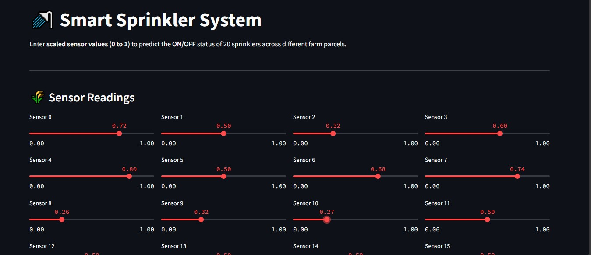

# 🌾 **SMART IRRIGATION SYSTEM – AI-POWERED SPRINKLER CONTROL**

💧 Save Water. Automate Irrigation. Boost Crop Health. A machine learning-based irrigation system with a Streamlit-powered web app to predict ON/OFF status of 20 sprinklers using real-time sensor data.

## ✨ Features
✅ 20 Sensor Inputs via interactive sliders (0 to 1)  
✅ Instant Sprinkler Prediction (ON/OFF)  
✅ Multi-label Machine Learning with RandomForestClassifier  
✅ Beautiful & Responsive Streamlit UI  
✅ Supports Live Deployment on Streamlit Cloud  

---

## 🖥️ Demo Preview
🎯 Input Sensors → 💡 Instant Sprinkler Decision

Sensor_0: 0.7  →  Sprinkler 0: ON  
Sensor_1: 0.2  →  Sprinkler 1: OFF  
...

### 📸 Screenshots

#### 1️⃣ Web App Homepage

#### 2️⃣ Sprinkler Prediction

---

## 🛠️ Tech Stack
| Category        | Tools/Libs Used                        |
|-----------------|----------------------------------------|
| Frontend (UI)   | Streamlit                              |
| Backend (ML)    | Scikit-learn, NumPy                     |
| Model Saving    | Joblib                                 |
| Data Handling   | Pandas                                 |
| Visualization   | Streamlit components & Markdown        |

---

## 📂 Project Structure
📁 Smart_Irrigation_AICTE
├── app.py # Streamlit web app
├── Farm_Irrigation_System.pkl # Trained ML model
├── irrigation_data.csv # Dataset for model training
├── irrigation.ipynb # Notebook for model building
├── requirements.txt # Dependencies for deployment
└── README.md # Project Documentation

## 🚀 How to Run Locally

1️⃣ **Clone the Repository**
git clone https://github.com/arijit-7612/Smart_Irrigation_AICTE.git
cd Smart_Irrigation_AICTE
2️⃣ Install Dependencies
pip install -r requirements.txt
3️⃣ Run the Streamlit App
streamlit run app.py
4️⃣ Open in Browser
http://localhost:8501
ℹ️ About
This is an AICTE Internship project.

